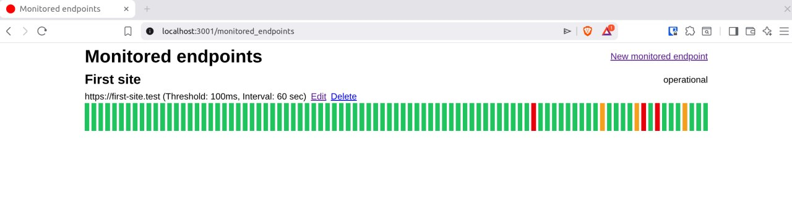

# Status Monitoring — Technical Assignment

This project is a **super-simplified analogue of an endpoint response time monitoring service**.



## Inspiration

- [https://status.openstatus.dev/](https://status.openstatus.dev/)
- [https://status.status.io/](https://status.status.io/)
- [https://status.dropbox.com/](https://status.dropbox.com/)

## Description

The system allows you to configure and monitor an arbitrary number of endpoints.
For each endpoint, you can specify:

- **Name**
- **URL** to poll
- **Maximum acceptable response time** (in milliseconds)
- **Polling interval** (from 1 minute to 1 hour)

A background job periodically polls the configured endpoints according to their polling intervals.
The current status of each endpoint is displayed in the UI:

- **operational** — returned a 2xx/3xx status within the specified response time
- **degraded** — responded successfully, but exceeded the specified response time
- **incident** — did not respond or returned a non-2xx/3xx status

---

## Running the Project

The development environment is configured using **devenv** and **direnv**.

- **devenv** — allows declarative configuration of the development environment, including required dependencies and services.
- **direnv** — automatically loads the development environment when entering the project directory. Without it, you would need to run `devenv shell` manually.

### Setup

Clone the repository:

```bash
git clone git@github.com:badenkov/status_monitoring.git
cd status_monitoring
direnv allow
```

Install dependencies and set up the database:

```bash
bundle install
bin/rails db:setup
```

### Start the Application

```bash
bin/dev
```

Then open the application in your browser:

```
http://localhost:3001
```
